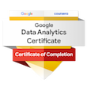
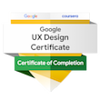

[Home Page](./) | [Internship](./cooledtured-internship.html) | [Academic Journey](./cs-capstone.html)  
# _Introduction_

Hi, I’m Kalee, and welcome to my E-Portfolio! Here, you'll find my resume, details about my areas of specialization, projects I've worked on, and more about my journey. Feel free to jump straight to the table of contents to explore, or keep scrolling to check out everything I’ve shared! [Skip to Table of Contents](#table-of-contents)

I'm a Junior Data, Solution, and Process Engineer and Analyst passionate about designing and implementing data infrastructure, developing technical solutions to business challenges, and optimizing processes with a strong data analysis, database management, and programming foundation. I’m always eager to learn and grow in the field. As a fast learner, I’m constantly take on new challenges to improve my skills and expand my knowledge.

I specialize in implementing solutions that solve complex problems, optimize data pipelines, and automate workflows to make processes more efficient. I also love creating visualizations that make complex data easy to understand. Whether it’s improving systems or extracting valuable trends, I’m dedicated to making data powerful and accessible to drive better decisions.

Feel free to explore my projects on this website (E-Portfolio), check out my work on [GitHub](https://github.com/Kalee914), or connect with me on [LinkedIn](https://www.linkedin.com/in/kalee-l-566433184/)! 

## _Table of Contents_
- [Technical Skills](#technical-skills)
- [Education](#education)
- [Certifications](#certifications)
- [Volunteer Experience At Cooledture Collection](#volunteer-experience)
- [Projects](#projects)
- [Soft Skills](#soft-skills)
- [Download My Resume (PDF)](assets/KaLee_Li_Resume_Watermarked_25.pdf){:target="_blank"}

[Back to Introduction](#introduction)

## _Technical Skills_

**Programming Languages:**  
&nbsp;&nbsp;&nbsp;&nbsp;&nbsp; Python (Pandas, Matplotlib, NumPy), R, JavaScript, VBA, SQL

**Databases & Warehousing:**  
&nbsp;&nbsp;&nbsp;&nbsp;&nbsp;RDBMS (SQL, MySQL, SQLite), NoSQL (MongoDB), BigQuery  

**Data Engineering:**  
&nbsp;&nbsp;&nbsp;&nbsp;&nbsp;ETL, Data Pipelines, Data Transformation, Web Scraping (Selenium, BeautifulSoup), API Wrapper/ Data Collection (e.g., asyncpraw, tweepy, pytrends, Jikan). 

**Data Analysis & Mining:**  
&nbsp;&nbsp;&nbsp;&nbsp;&nbsp;Clustering, Trend Analysis (Google Trends API/Pytrends), Classification, Text Mining  

**Visualization, Reporting & Presentation Tools:**  
&nbsp;&nbsp;&nbsp;&nbsp;&nbsp;Tableau, Power BI, Excel(XLOOKUP, Pivot Tables, Formulas), Google Sheets (VLOOKUP, Pivot Tables, Formulas), ggplot (R), Lucidchart, Google Slide, Genially  

**Tools & Environments:**  
&nbsp;&nbsp;&nbsp;&nbsp;&nbsp;Codio, Jupyter Notebook, Colab, MS Office, Google Workspace, PyCharm, VS Code, Google App Script, MS Power Platform, Excel, IBM Cloud, phpMyAdmin

**Project Management:**  
&nbsp;&nbsp;&nbsp;&nbsp;&nbsp; SDLC | Agile (Scrum) | Waterfall  

[Back to Table of Contents](#table-of-contents)

## _Education_

**Associate Degree in Computer Science**  
&nbsp;&nbsp;&nbsp;&nbsp;&nbsp;Southern New Hampshire University — March 2023  

**Bachelor of Science in Computer Science**  
&nbsp;&nbsp;&nbsp;&nbsp;&nbsp;Southern New Hampshire University — April 2025  
&nbsp;&nbsp;&nbsp;&nbsp;&nbsp;[Computer Science Capstone Project](./cs-capstone.html)  

## _Certifications_  

[Click here to view certificate](https://coursera.org/share/ba9fb6984954d1f7f568b757fae57747){:target="_blank"}  

[Click here to view certificate](https://coursera.org/share/1c6a7f20e76947b027bacb0d5b7d0a84){:target="_blank"}  

- **IBM Data Engineering** (In Progress)  
- **IBM Full-Stack JavaScript Developer** (In Progress)  

[Back to Table of Contents](#table-of-contents)

## _Volunteer Experience_  

I've been with Cooledtured Collection since October 2024, started as a Data Research Analyst intern. Overtime, I transitioned to focus on system architecture, data engineering, process optimization, and automation. I began designing and implementing data pipelines, managing data infrastructure, and developing technical solutions to improve workflows. Additionally, I worked on optimizing processes and automating tasks to enhance team efficiency.

To learn more about my experience with Cooledtured Collection, feel free to check out my [Internship – Cooledtured Collection](./cooledtured-internship.html) page. If you're interest in seeing the projects I’ve worked on, you can explore the [Projects section - Click here](#projects) and select the project you want to see! Some of my projects have already been completed, but I haven’t pushed them up here yet because I’m currently focused on working on projects in progress. I’ll be updating them soon. Feel free to email me if you’d like to see something in particular; my email is listed in my resume.

  
[Back to Table of Contents](#table-of-contents)

## _Projects_  
**Cooledtured Internship Projects** - [Cooledtured Internship Projects Overview](./cooledtured-internship.html)  
- **Data Analysis Projects** 
    - [Competition Analysis for Inspiration](./cooledtured-internship.html#competition-analysis-for-inspiration-boxlunch)
        - Conducted extensive market and social media analysis using web scraping, Google Trends, and other data mining techniques to provide actionable insights for business decisions.  
    - [Social Media Content Analysis](./cooledtured-internship.html#social-media-insight-and-content-analysis)
        - Led data collection and analysis of social media platforms, evaluating content performance and engagement to identify key factors for content strategy improvement.        
- **Junior Solution Engineer Projects**  
    - [Bottleneck Analysis for Content Creation Team](./cooledtured-internship.html#bottleneck-analysis-for-content-creation-team)
        - Analyzed and identified inefficiencies in the content creation workflow. Proposed and implemented process optimizations, improving team efficiency and reducing project delays.
    - [Data Team Optimization Strategy Project](./cooledtured-internship.html#data-team-optimization-strategy-project)
        - Worked with a team to design a strategy that enhanced communication, resource management, and cross-team collaboration, resulting in a more effective workflow.  
- **Junior Data Engineer Projects**  
    - [Automated Content ELT Pipeline (Junior-Level))](./cooledtured-internship.html#automated-content-elt-pipeline)
        - Automated the extraction, transformation, and loading of content data into a master dataset, optimizing data handling processes and improving reporting accuracy.
    - [Forms Tracker (Entry-Level)](./cooledtured-internship.html#forms-tracker)
        - Developed an automated system for tracking and managing creator submissions, ensuring timely data collection and error-free reporting using Google Sheets.
- **Junior Process Engineering Projects**
    - [HR Automation System](./cooledtured-internship.html#hr-automation-system-internship-recruitment-system)
        - Designed and implemented an automated email pipeline for the recruitment process, significantly reducing manual workload and ensuring timely communication with candidates.  

**SNHU Computer Science Capstone Project** - [Academic Journey Page](./cs-capstone.html)
- **Software Design and Engineering**
    - [Authentication and Authorization](./cs-capstone.html#enhancement-1-software-design-and-engineering)  
- **Algorithms and Data Structure**
    - [Security and Authentication](./cs-capstone.html#enhancement-2-algorithms-and-data-structure)  
- **Databases** 
    - [Database Management and Data Analytics](./cs-capstone.html#enhancement-3-databases)

**Self-Project** (In-Progress)
- **Pytrend**
- **PowerFunQuest**

[Back to Table of Contents](#table-of-contents)

## _Soft Skills_  

- **Active Listening**
- **Critical & Analytical Thinking**
- **Problem Solving**
- **Collaboration**
- **Communication**
- **Creativity**
- **Decision-Making**
- **Leadership**
- **Teamwork**
- **Time Management** 

[Back to Table of Contents](#table-of-contents)

## _Resume_  
You can view and download my resume here:  

[Download My Resume (PDF)](assets/Kalee Li - Data, Solution, and Process Engineer and Analyst Resume (Watermarked).pdf){:target="_blank"}

[Back to Table of Contents](#table-of-contents)