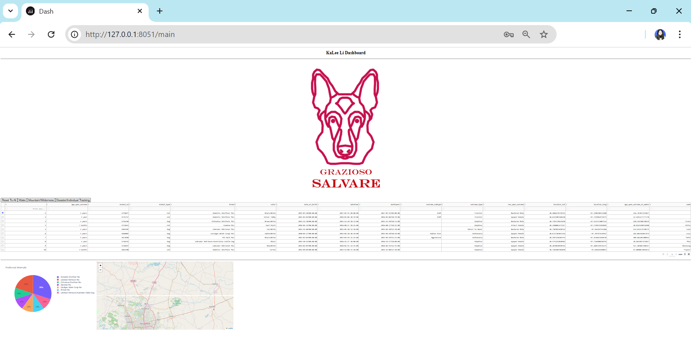
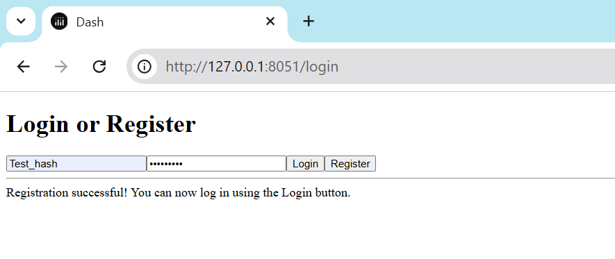
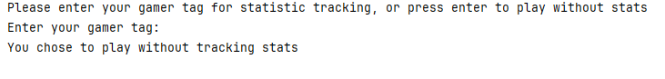

[Link to another page](./another-page.html).

# _Introduction_

Welcome to my portfolio. My name is Ka Lee Li, and I have been a student in the Southern New Hampshire University (SNHU) Computer Science program for four years. Throughout this journey, I’ve developed technical skills and essential professional abilities that prepare me to be proficient in the computer science field. Completing my coursework and developing a portfolio has allowed me to showcase three of my enhanced projects focused on **_Software Engineering and Design_**, **_Algorithms and Data Structures_**, and **_Databases_**, demonstrating my strengths in the following areas: _**Collaborative Environment, Professional Communication, Computing Solutions, Innovation Techniques, and Security Mindset**_. 

## _Table of Contents_
1. **[Professional Self-Assessment - Skills Overview](#1-professional-self-assessment---skills-overview)**
    - [1.1. Collaborating in a Team Environment](#11-collaborating-in-a-team-environment)
    - [1.2. Communicating with Stakeholders](#12-communicating-with-stakeholders)
    - [1.3. Software Design and Engineering](#13-software-design-and-engineering)
    - [1.4. Algorithms and Data Structure](#14-algorithms-and-data-structure)
    - [1.5. Databases](#15-databases)
2. **[Code Review](#2-code-review)**
3. **[Enchancements](#3-enhancements)**
    - [Enhancement 1: Software Design and Engineering (Authentication and Authorization)](#enhancement-1-software-design-and-engineering)
    - [Enhancement 2: Algorithms and Data Structure (Security and Authentication)](#enhancement-2-algorithms-and-data-structure)
    - [Enhancement 3: Databases(Database Management and Data Analytics)](#enhancement-3-databases)

## _1. Professional self-assessment - Skills Overview_

As a Computer Science student, I’ve gained critical insights into writing good code, emphasizing readability, maintainability, and adherence to ethical standards. Good code isn't just error-free and runnable; it should be well-structured and easy for other Developers/Engineers to read, understand, and maintain. In addition to writing readable code, I learned the importance of implementing authentication and authorization measures and following the GDPR during the application development process to protect our users' PHI and PII. One of my coursework in CS 250: Software Development Lifecycle introduced me to the Agile methodology, which I now apply in organizing tasks and addressing problems systematically on a daily basis. These experiences reflect my values of collaboration, precision, and continuous improvement.

[Back to the Top](#introduction)

### 1.1. Collaborating in a Team Environment

I have focused on ensuring that my code is clear, maintainable, and easy for other developers to understand. This emphasizes the importance of readable code in a collaborative team environment so that the other developers can easily follow the logic and structure, whether we are working on the same project or reviewing the code at a later stage. 
In addition to writing clean code, I have conducted a code review before working on enhancement projects to ensure it meets best practices. This self-review process to ensure the code is concise, well-commented, and update-ready improved the code quality, aligning it with industry standards. 

[Back to the Top](#introduction)
### 1.2. Communicating with Stakeholders

As mentioned earlier, I was introduced to agile methodology when I took CS250; I learned that the project charter is one of the key documents for the agile team to communicate effectively with stakeholders and is often created at the start of the project. The project charter provides a high-level overview comprising project participants such as teammates and stakeholders, communication guidelines, project objectives, requirements, constraints, rules, tools, deliverables, and success criteria. In addition to the elements included in the charter document, we should keep it concise, clear, and specific and involve stakeholders early to get their input.  This coursework has equipped me with the skills to ensure clear and effective communication with stakeholders throughout the project lifecycle. 

[Back to the Top](#introduction)

### 1.3. Software Design and Engineering

This artifact showcases my ability to design and enhance interactive software applications that focus on user interaction. It highlights the development and implementation of authentication and authorization features in the web-based dashboard. This work demonstrated user-centric design, secure access management, and backend development using Python, Dash, and MongoDB. 

[Back to the Top](#introduction)

### 1.4. Algorithms and Data Structure

This artifact demonstrates my ability to integrate complex algorithms and data structures to strengthen application security. I incorporated cryptographic practices and role-based access control mechanisms to ensure secure credential management and access control in the web application. This project reflects my skills in implementing secure workflows, working with hashing algorithms, and managing database authentication. 

[Back to the Top](#introduction)

### 1.5. Databases

This artifact highlights my growth in database management and analytical skills through the enhancement of a nostalgic text-based game. I integrated an SQLite database to track player performance and generate analytical insights, transforming a simple game into a data-driven program. This work showcases my skills in managing databases, performing data analysis, and refactoring code for scalability and maintainability.  

[Back to the Top](#introduction)

## _2. Code Review_
### Code Reivew Video

<iframe width="350" height="197" src="https://www.youtube.com/embed/X5N-xtKAyJ0?si=DF1IUjbieUU_OZnJ" title="YouTube video player" frameborder="0" allow="accelerometer; autoplay; clipboard-write; encrypted-media; gyroscope; picture-in-picture; web-share" referrerpolicy="strict-origin-when-cross-origin" allowfullscreen></iframe>

[Back to the Top](#introduction)

## _3. Enhancements_
### Enhancement 1: Software Design and Engineering
Animal Shelter Training Web Application - Authentication and Authorization

This artifact is an Animal Rescue Training web application dashboard designed for an international rescue animal training company. The purpose of the dashboard is to assist in identifying dogs for training by presenting data visually and interactively to support decision-making. The application uses Dash in Python to build the interface and Dash Leaflet to build map-based interaction, enabling users to view the animal's information and filter data based on specific parameters. It also incorporates libraries such as pandas, numpy, and matplotlib.pyplot, along with MongoDB for database management and CRUD functionality. This application was created when I took CS 340 Client/Server Development, term 2024 C-1 Jan to Mar. 

This enhancement focused on improving user interaction by implementing authentication and authorization features. Initially, the application used a hardcoded username and password for access. I removed this insecure practice and added user registration and login functionality, allowing for a secure user experience. These improvements refined its backend development aspects, demonstrating my skills in designing user-friendly interfaces, managing secure access, and performing database operations to support user interaction. 

[Click here to explore the project on GitHub](https://github.com/Kalee914/kalee914.github.io/tree/Software-Design-and-Engineering)

[Back to the Top](#introduction)

### Enhancement 2: Algorithms and Data Structure
Animal Shelter Training Web Application - Security and Authentication

This artifact is an Animal Rescue Training web application dashboard designed for an international rescue animal training company. The purpose of the dashboard is to assist in identifying dogs for training by presenting data visually and interactively to support decision-making. The application uses Dash in Python to build the interface and Dash Leaflet to build map-based interaction, enabling users to view the animal's information and filter data based on specific parameters. It also incorporates libraries such as pandas, numpy, and matplotlib.pyplot, along with MongoDB for database management and CRUD functionality. This application was created when I took CS 340 Client/Server Development, term 2024 C-1 Jan to Mar. 

This enhancement emphasizes securing sensitive user credentials by integrating the Bcrypt hashing library, utilizing MongoDB authentication mechanisms and role-based access control to assign users a specific role, and validating stored credentials in the Authentication Source database. This enhancement artifact demonstrates my understanding of authentication workflows, cryptographic algorithms, role assignments, and database access protocols, showcasing my ability to protect user information effectively and strengthen application security. 

[Click here to explore the project on GitHub](https://github.com/Kalee914/kalee914.github.io/tree/Algorithms-and-Data-Structure)

[Back to the Top](#introduction)

### Enhancement 3: Databases
Text-Based Game “Don’t Wake Dad” - Database Management and Data Analytics

This artifact is a Text-Based Game called "Don't Wake Dad!" The idea of the game is that the player navigates through rooms, collecting all the items in each room (cleaning the house) while avoiding waking the dad up by entering the parent's room before all the items are collected. This game was created when I took my first Python class, IT140, Introduction of Scripting, in the winter of 2021. This project holds nostalgic value as it represents the start of my programming journey. I selected this artifact to enhance and highlight my growth in coding and database management. The original game contained all the logic in a single script, showcasing basic programming concepts.

For this enhancement, I refactored the code to improve its structure and functionality. By modularizing the functions, I increased the code's readability and maintainability. Furthermore, I integrated a SQLite database to track player progress and generate an analysis report of average wins and losses. These updates enhanced the game’s functionality and player engagement, demonstrating my database management and data analytics skills and highlighting my growth in creating interactive and data-supported programs. 

[Click here to explore the project on GitHub](https://github.com/Kalee914/kalee914.github.io/tree/Database)

[Back to the Top](#introduction)